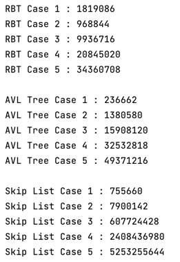
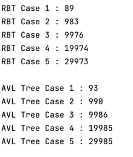
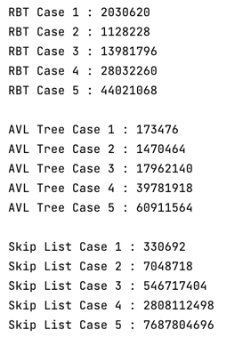
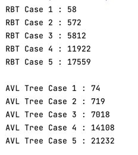
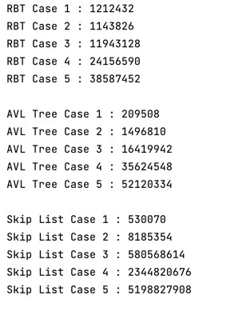
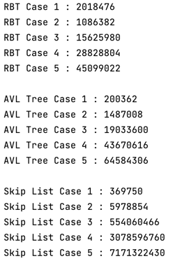

# Homework 5 : Red Black Tree

# 获取实验数据
```c
static inline uint64_t rdtsc() {
    uint32_t low, high;
    asm volatile ("rdtsc" : "=a" (low), "=d" (high));
    return ((uint64_t) high << 32) | low;
}
```

## Insert

### 要求即实现

**要求**
* 五组输入集
* 采用顺序、乱序两种输入方式

**实现**
* 五组输入集大小 :  100， 1000， 10000， 20000， 30000
* 说明
    * 前三个为指数关系增长，后三个成线性增长
    * 后三组数据更大，增加实验可靠性
* 顺序插入时使用`set`容器

### 顺序插入

#### 红黑树、AVL树、跳表 耗时

**实验图片**


|               | 100 | 1000 | 10000 | 20000 | 30000 |
|:-------------:|:---:|:----:|:-----:|:-----:|:-----:|
| RedBlack Tree |   1819086  |    968844  |    9936716   |    20845020   |   34360708    |
|   AVL Tree    |   236662  |  1380580    |  15908120     |    32532818   | 49371216      |
|   Skip List   |   755660  |  7900142    |   607724428    |    2408436980   |     5253255644  |


#### 红黑树、AVL树 旋转次数

**实验图片**


|               | 100 | 1000 | 10000 | 20000 | 30000 |
|:-------------:|:---:|:----:|:-----:|:-----:|:-----:|
| RedBlack Tree |  89   |    983  |   9976    |  19974     |  29973     |
|   AVL Tree    |  93   |    990  |    9986   |   19985    |   29985    |


### 乱序插入

#### 红黑树、AVL树、SkipList耗时

**实验图片**


|               |   100   |  1000   |   10000   |   20000    |   30000    |
|:-------------:|:-------:|:-------:|:---------:|:----------:|:----------:|
| RedBlack Tree | 2030620 | 1128228 | 13981796  |  28032260  |  44021068  |
|   AVL Tree    | 173476  | 1470464 | 17962140  |  39781918  |  60911564  |
|   Skip List   | 330692  | 7048718 | 546717404 | 2808112498 | 7687804696 |


#### 红黑树、AVL树旋转次数

**实验图片**



|               | 100 | 1000 | 10000 | 20000 | 30000 |
|:-------------:|:---:|:----:|:-----:|:-----:|:-----:|
| RedBlack Tree | 58  | 572  | 5812  | 11922 | 17559 |
|   AVL Tree    | 74  | 719  | 7018  | 14108 | 21232 |


## Search

### 要求即实现

**要求**

* 五组查找集
* 乱序和顺序两种查找方式
* 所有的key都是已经存在的

**实现**

* 五组查找集合见上述插入集，为插入集的10倍
* 插入集数据 : 1000， 10000， 100000， 200000， 300000
* 插入值另存在数组中，取值思路为
```cpp
ofstream fout("search.txt") // 声明
for(int i = 1; i <= n; i++) // 插入n个值
    fout << "s " << dataBase[rand % size + 1] << std::endl;// 读入文件
/*
 * 空间开销巨大，(约10Mb)，但是可以保证这些时间开销不会算入运算时间
 * 并且存入外存，可以保证栈空间足够使用
 */
```
### 顺序查找耗时 : 红黑树、 AVL树、 跳表 

**实验图片**


|               | 1000 | 10000 | 100000 | 200000 | 300000 |
|:-------------:|:----:|:-----:|:------:|:------:|:------:|
| RedBlack Tree |   1212432   |   1143826    |  11943128      |  24156590      |   38587452     |
|   AVL Tree    |    209508  |     1496810  |  16419942      |    35624548    |    52120334    |
|   Skip List   |    530070  |  8185354     |    580568614    |      2344820676  |    5198827908    |


### 乱序查找耗时 : 红黑树、 AVL树、 跳表

**实验图片**


|               |  1000   | 10000 | 100000 | 200000 | 300000 |
|:-------------:|:-------:|:----:|:------:|:------:|:------:|
| RedBlack Tree | 2018476 |   1086382   | 15625980       |     28828804   |45099022        |
|   AVL Tree    |    200362     |1487008      |   19033600     |    43670616    | 64584306       |
|   Skip List   |     369750    |   5978854   |    554060466    |    3078596760    |   7171322430     |


# 分析实验结果
## 要求
分析所测红黑树、SkipList、 AVL 树的插入和查询操作开销是否符合理论（至少要对比在顺序和乱序输
入场景下三种结构的插入操作的耗时和两种树的旋转次数的对比以及查找操作的耗时对比），并说明自
己对数据结果差异的理解 : 

## 结论
红黑树，skiplist， AVL插入和查询操作时间开销上，跳表时间开销或许过大。

但是根据数据点可以看出，在这些操作中插入和查找操作基本符合`O(logN)`的时间复杂度。

旋转操作上也符合几乎为`O(logN)`的旋转次数,而且红黑树旋转次数也明显少于AVL树旋转次数，因为AVL树目的是几乎严格维护BST且平衡（平衡因子在1以内），红黑树的平衡是相对而言的平衡

* 比较顺序与乱序：
  * 旋转操作上，顺序比乱序有明显更多的旋转操作。
  * 时间开销上，顺序比乱序所花费时间开销更大，因为顺序与乱序相比是更接近最差情况插入或查找顺序。
    * 但是跳表在这个时候会表现出更快插入的优势。
